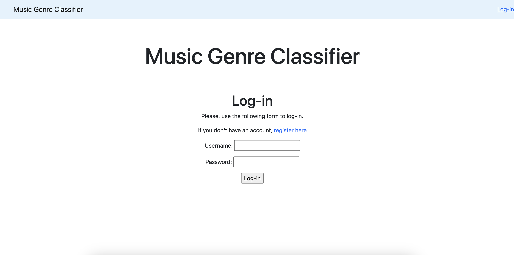
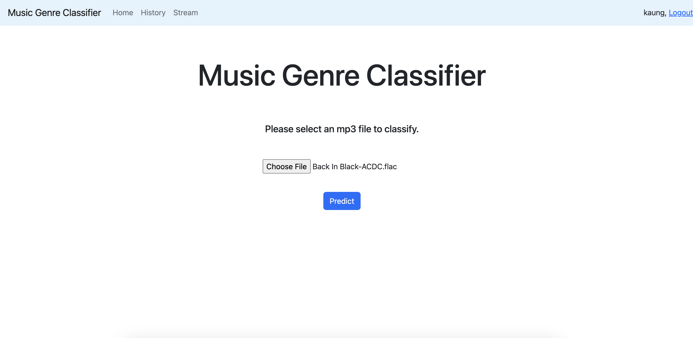
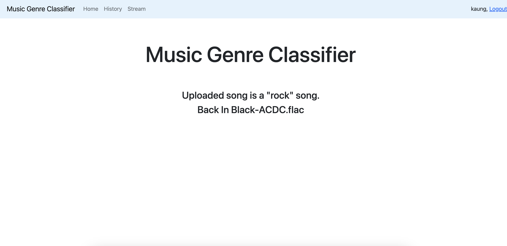
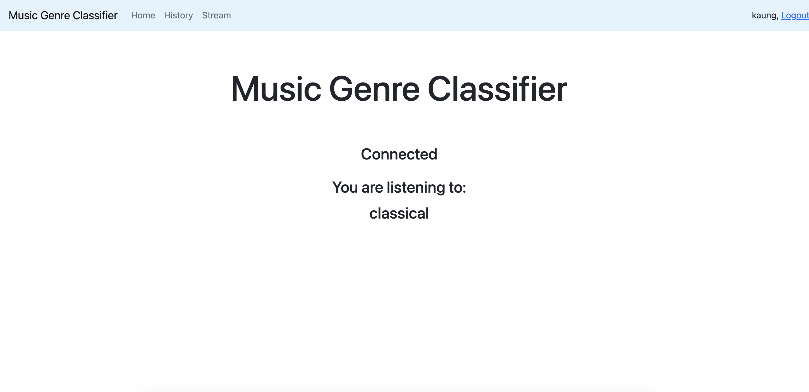
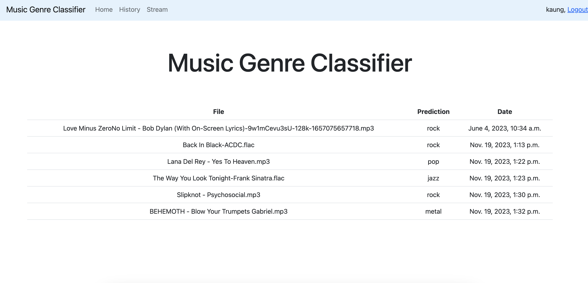

# Music Genre Classifier Web Server with Django

A simple Django web server to serve music genre classifier. Model training is implemented in https://github.com/kaung-htet-myat/music-classifier-training-api.   
   
The server provide following functionalities:
- User account management and authentications

- Classify genre of the uploaded music file

- Classify genre of the live streaming music from microphone

- Checking the file inference history
